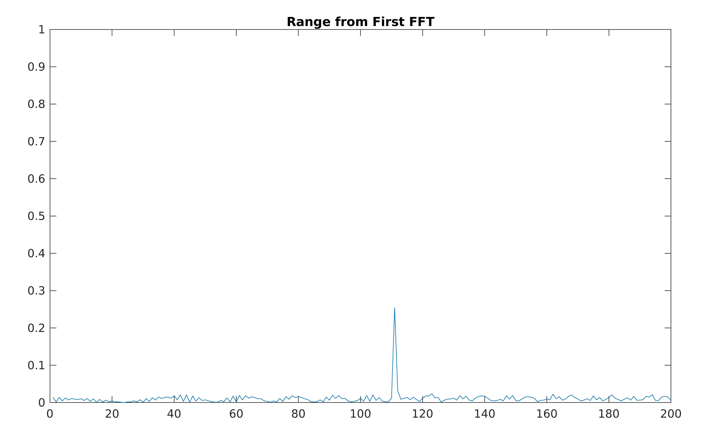
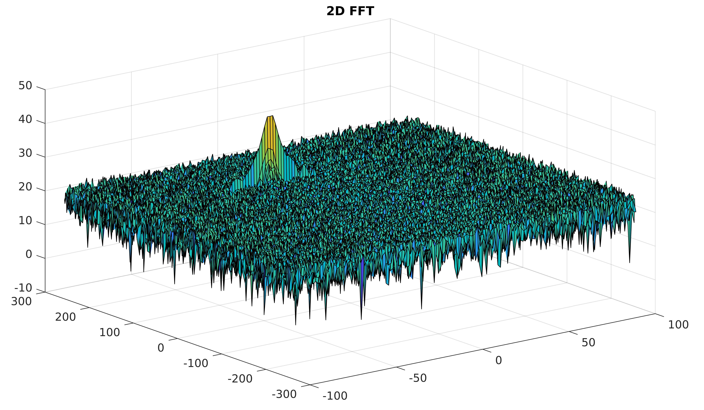
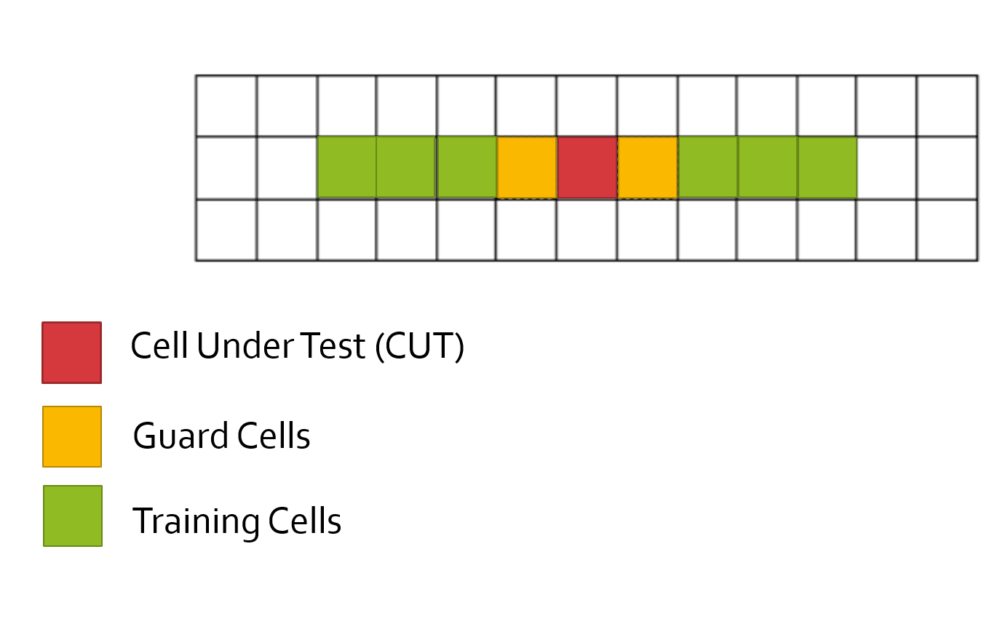

# SFND RADAR Target Generation and Detection

This is a practice on how to generate 2d FFT from the TX, RX and IR signals and also how to do a CFAR filtering. The main file is `radar-target-generation-and-detection.m` and is written for MATLAB.

## Project Overview


* Configure the FMCW waveform based on the system requirements.
* Define the range and velocity of target and simulate its displacement.
* For the same simulation loop process the transmit and receive signal to determine the beat signal
* Perform Range FFT on the received signal to determine the Range
* Towards the end, perform the CFAR processing on the output of 2nd FFT to display the target.

### Radar System Requirements

|Radar Specification|Value|
|-|-|
| Frequency | 77 GHz |
| Range Resolution | 1 m |
| Max Range | 200 m |
| Max Velocity | 70 m/s |
| Velocity Resolution | 3 m/s |

---
# Code Description 

## Radar Specification

```.m
c= 3e8; 
fc= 77e9;             %carrier freq
r_max = 200;
v_max = 100;
d_res = 1;
v_res = 3;
```

## User Defined Range and Velocity of target

I have chosen the following values for the target

```.m
R = 110;        %range
v = -20;        %speed
```

## FMCW Waveform Generation


Now it is required to generate the TX, RX and IF signals for the above obstacle.
TX is a chirp signal. Chirp is a sinusoidal signal which its frequency
is changing linearly with the time. The red line in the above picture is showning 
the frequency of TX signal with respect to the time. The blue line the frequency 
of the RX signal.
The parameters of TX chirp signal should be chosen based on the RADAR 
specification as follow
```.m
% Bandwidth for the each chirp for given resolution
B = c / (2 * d_res);

% Sweep time for chirp is defuned as rule by 5.5 times of round trip
Tchirp = 5.5 * 2 * r_max / c;

% The slope of the chirp
slope = B / Tchirp;

%The number of chirps in one sequence. Its ideal to have 2^ value for the ease of running the FFT
%for Doppler Estimation. 
Nd=128;                   % #of doppler cells OR #of sent periods % number of chirps

%The number of samples on each chirp. 
Nr=1024;                  %for length of time OR # of range cells
```

## Signal Generation

Based on the above calculations, now it is time to generate the signals as follow

```.m
%sampling time
dt = Tchirp / Nr;

for i=1:length(t)
    %For each time stamp update the Range of the Target for constant velocity. 
    r_t(i) = R + v * t(i);
    t_d(i) = 2 * r_t(i) / c;
    
    %For each time sample we need update the transmitted and
    %received signal. 
    Tx(i) = cos(2*pi*(fc*t(i) + slope * t(i)^2 / 2.0 ));
    Rx(i) = cos(2*pi*(fc*(t(i)-t_d(i)) + slope * (t(i)-t_d(i))^2 / 2.0 ));
    
    %Now by mixing the Transmit and Receive generate the beat signal
    %This is done by element wise matrix multiplication of Transmit and
    %Receiver Signal
    % Intermediate Signal
    Mix(i) = Tx(i).* Rx(i);
end
```

## Range Measurement

Now using the generated Intermediate Signal we try to calculate the range 
the we have chosen in one of the early stages. That is done using FFT of 
the mixed signal

```.m
%reshape the vector into Nr*Nd array. Nr and Nd here would also define the size of
%Range and Doppler FFT respectively.
Mi = reshape(Mix,Nr,Nd);

%run the FFT on the beat signal along the range bins dimension (Nr) and
%normalize.
f1 = fft(Mi,Nr);
f1 = f1/Nr;

% Take the absolute value of FFT output
f1 = abs(f1);

% Output of FFT is double sided signal, but we are interested in only one side of the spectrum.
% Hence we throw out half of the samples.
f1 = f1(1:Nr/2);
```

This would results in the following graph which shows and object close to 110 meters as we specified 
at the beginning



## RANGE DOPPLER RESPONSE

The 2d FFT code was already given to calculate the speed as follow:

```.m
% The 2D FFT implementation is already provided here. This will run a 2DFFT
% on the mixed signal (beat signal) output and generate a range doppler
% map.You will implement CFAR on the generated RDM

% Range Doppler Map Generation.

% The output of the 2D FFT is an image that has reponse in the range and
% doppler FFT bins. So, it is important to convert the axis from bin sizes
% to range and doppler based on their Max values.

Mix=reshape(Mix,[Nr,Nd]);

% 2D FFT using the FFT size for both dimensions.
sig_fft2 = fft2(Mix,Nr,Nd);

% Taking just one side of signal from Range dimension.
sig_fft2 = sig_fft2(1:Nr/2,1:Nd);
sig_fft2 = fftshift (sig_fft2);
RDM = abs(sig_fft2);
RDM = 10*log10(RDM) ;

%use the surf function to plot the output of 2DFFT and to show axis in both
%dimensions
doppler_axis = linspace(-100,100,Nd);
range_axis = linspace(-200,200,Nr/2)*((Nr/2)/400);

subplot(3,1,2);


surf(doppler_axis,range_axis,RDM);
title('2D FFT')
```

which resulted in the following picture



## CFAR implementation

In CFAR we loop over all the bins in the 2d image and put each cell under the test.
It is required to choose few the number of training and guard cells in the following image



I have chosen the following number of cells in 2D

```.m
%Select the number of Training Cells in both the dimensions.
T = [12,6];

%Select the number of Guard Cells in both dimensions around the Cell under 
%test (CUT) for accurate estimation
G = [4,2];
```

We initialize a vector as the same size of the 2d FFT to recorder
the results of the CFAR into it as follow

```.m
signal_cfar = zeros(size(RDM));
```

And also we choose the offset as 
```.m
offset = 5;
```

Then we just simply loop over the 2d FFT and calculate the 
threshold for each cell under the test and filtering out the noises

```.m
for i = (  (T(1) + G(1) + 1 )  :  (x_shape - ( T(1) + G(1) + 1 ))  )
    for j = (  (T(2) + G(2) + 1 )  :  (y_shape - ( T(2) + G(2) + 1 ))  )
        % Use RDM[x,y] as the matrix from the output of 2D FFT for implementing
        % CFAR
        noise_level = sum(db2pow(RDM( i-T(1)-G(1) : i + T(1)+ G(1), j-T(2)-G(2) : j + T(2)+ G(2)  )),'all') - ...
            sum(db2pow(RDM( i-G(1) : i + G(1), j-G(2) : j + G(2)  )),'all');
        
        num_cells_in_noise_level = (2*(T(1)+G(1))+1) * (2*(T(2)+G(2))+1) ...
            - (2*G(1)+1)* (2*G(2)+1);
        threshold = pow2db(noise_level / num_cells_in_noise_level);
        threshold = threshold + offset;
        threshold_cfar(i,j) = threshold;
        
        CUT = RDM(i,j);
        
        if (CUT > threshold)
            signal_cfar(i,j) = 1;
        end
    end
end
```

If you pay attention to the limits of the for loop, it allows for the number of 
guard cells and training cells at the beginning and the end of the 2d FFT.
```
for i = (  (T(1) + G(1) + 1 )  :  (x_shape - ( T(1) + G(1) + 1 ))  )
    for j = (  (T(2) + G(2) + 1 )  :  (y_shape - ( T(2) + G(2) + 1 ))  )
```

And then we are summing up all the surroundings cells of the CUT 
except those are guarded and the CUT cell it self. So That is done by first calculating 
the all sums around the cell and the the sum of guard cells and CUT is subtracted from the 
previous sum as follow:
```.m
        noise_level = sum(db2pow(RDM( i-T(1)-G(1) : i + T(1)+ G(1), j-T(2)-G(2) : j + T(2)+ G(2)  )),'all') - ...
            sum(db2pow(RDM( i-G(1) : i + G(1), j-G(2) : j + G(2)  )),'all');
```

And then the rest are only to calculate the average, consider the offset and
filter out the values and convert them from double values to a binary form of 
zero or one. Because the `signal_cfar` is initializes with all zeros, it is not 
needed to rewrite zeros when the value of CUT is less than the threshold.

The following image shows the complete results

